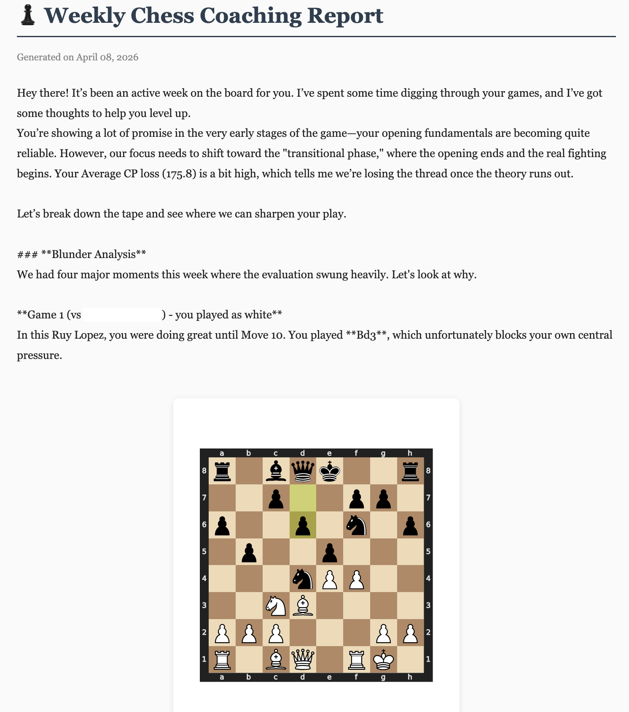
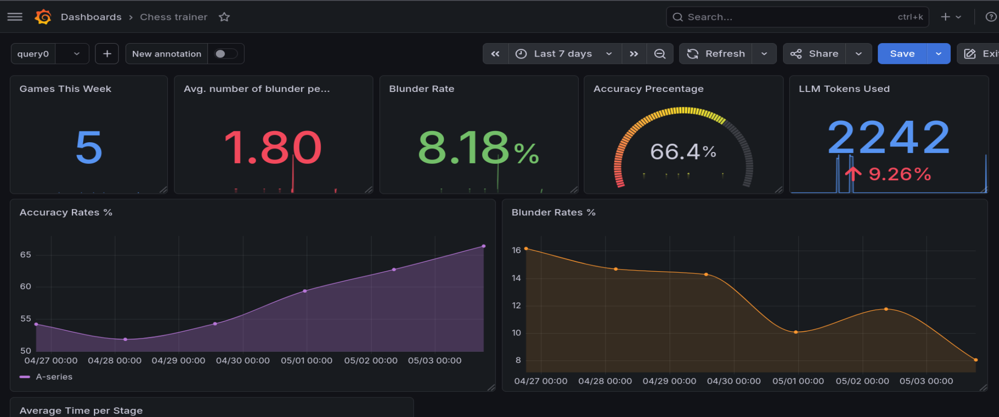

# ♟️ Chess Game Intelligence Agent Platform

An automated chess analysis platform that collects your games from Lichess, analyzes them with Stockfish and AI, generates weekly reports, and visualizes your progress through a Grafana dashboard.

Built with a production-grade infrastructure: containerized microservices, automated scheduling with Celery, cloud deployment on AWS via Terraform, and a full observability stack.

Example of a generated report:



---
## Architecture

```
┌─────────────────────────────────────────────────────┐
│                    AWS EC2 Instance                 │
│                                                     │
│  ┌─────────────┐    ┌──────────────────────────┐    │
│  │ celery-beat │───►│      celery worker       │    │
│  │  scheduler  │    │  collect → analyze →     │    │
│  └─────────────┘    │       report             │    │
│                     └──────────────────────────┘    │
│                                                     │
│  ┌──────────┐  ┌──────────┐  ┌───────────────────┐  │
│  │ Postgres │  │  Redis   │  │     Stockfish     │  │
│  └──────────┘  └──────────┘  └───────────────────┘  │
│                                                     │
│  ┌──────────┐  ┌──────────┐  ┌───────────────────┐  │
│  │ Grafana  │  │Prometheus│  │   Pushgateway     │  │
│  └──────────┘  └──────────┘  └───────────────────┘  │
└─────────────────────────────────────────────────────┘
```
_Local self-hosting is also supported._
---

## 🎯 What It Does

Every week, this platform:

1. **Pulls your games** from Lichess API
2. **Analyzes each move** with Stockfish (depth 20)
3. **Identifies patterns** — blunders, mistakes, opening weaknesses
4. **Generates a coaching report** using Gemini AI with personalized feedback
5. **Tracks metrics** — cost per run, blunder rate over time, LLM latency etc.
6. **Generates you an HTML report** with board diagrams with insights and recommendations

It's like having a personal chess coach who never sleeps.

---

## 🚀 Features

### Chess Analysis
- Stockfish engine integration over TCP (multi-stage Docker build)
- Classifies moves: Good / Inaccuracy / Mistake / Blunder
- Stores analysis in PostgreSQL for historical tracking
- Generates SVG board diagrams for every significant position

### AI Coaching
- LLM-powered (Gemini/Claude (optional)) personalized coaching reports
- Identifies recurring patterns across multiple games
- Suggests training plans based on your actual weaknesses
- References specific games: "In Game 2 vs player123, move 15..."

### Observability Stack
- **Prometheus** — tracks pipeline health, cost, latency
- **Grafana** — visualizes trends over time
- **Cost tracking** — every LLM call logged with token count and USD cost
- **Failure monitoring** — know immediately when a stage breaks

### Automation
- **Celery Beat** — runs collection + analysis + reporting on a schedule
- **Redis** — message broker for task queue
- **Docker Compose** — entire stack in one command

**Services:**
- `postgres` — stores games, moves, LLM reports, metrics
- `stockfish` — chess engine exposed via socat TCP bridge
- `collector` — fetches games from Lichess API
- `analyzer` — runs Stockfish analysis on each game
- `reporter` — generates LLM coaching reports with board diagrams
- `celery` — scheduler for automated runs
- `redis` — message broker
- `prometheus` — metrics storage
- `grafana` — metrics visualization
- `pushgateway` — receives metrics from batch jobs

---

## 🛠️ Tech Stack

| Layer | Technology |
|---|---|
| **Language** | Python 3.11 |
| **Infrastructure** | Terraform, AWS EC2 |
| **Chess Engine** | Stockfish (compiled from source) |
| **LLM** | Gemini 1.5 Flash (free tier) |
| **Database** | PostgreSQL 16 |
| **Scheduler** | Celery + Redis |
| **Observability** | Prometheus + Grafana |
| **Containerization** | Docker + Docker Compose |
| **Networking** | socat TCP bridge for engine communication |

---

## 🚀 Quick Start

### Prerequisites
- Docker & Docker Compose
- Lichess account
- Gemini API key (free at https://aistudio.google.com)
- For cloud deployment + an AWS account

---

### Quick Start — Local Setup

**1. Clone the repo**
```bash
git clone https://github.com/yourusername/chess-trainer.git
cd chess-trainer
```

**2. Set environment variables**
```bash
cat > .env << EOF
LICHESS_USERNAME=your_username
GEMINI_API_KEY=your_key_here
LLM_PROVIDER=gemini
EOF
```

**3. Start the stack**
```bash
docker compose up -d
```

That's it. The pipeline runs automatically every Friday. To trigger it manually for testing:
```bash
docker-compose exec celery -- celery -A celery_app call tasks.run_full_pipeline
```

**4. Access your dashboards**

| Service | URL |
|---|---|
| Grafana | http://localhost:3000 (admin / admin) |
| Prometheus | http://localhost:9090 |
| Pushgateway | http://localhost:9091 |

---

### Cloud Deployment — AWS

#### First-time setup

**1. Install and configure AWS CLI**
```bash
aws configure
# Enter your IAM user Access Key ID, Secret, and region (e.g. eu-central-1)
```

> **Note:** It is recommended to noy use root account credentials (You will see a note about it in the AWS console when trying to get the keys). I would recommend you to reate an IAM user with `AdministratorAccess` and use those keys instead.

**2. Create your Terraform variables file**
```bash
cd terraform
cp terraform.tfvars.example terraform.tfvars
```
Edit `terraform.tfvars`:
```hcl
project_name  = "chess-trainer-platform"
instance_type = "t3.micro"
admin_ip_cidr = "YOUR_IP/32"  # find your IP at whatismyip.com
```

#### Deploy

```bash
# Validate configuration
terraform init
terraform validate
terraform plan

# Deploy to AWS
terraform apply
```

#### Connect to your instance

```bash
# Get your instance ID
aws ec2 describe-instances \
  --filters "Name=tag:Name,Values=chess-trainer-platform" \
  --query "Reservations[].Instances[].InstanceId" \
  --output text

# Connect via SSM (no SSH key or open ports needed)
aws ssm start-session --target <instance-id>
```

#### Start the application

Once connected to the instance:
```bash
git clone https://github.com/yourusername/chess-trainer.git
cd chess-trainer
# fill in your credentials
cat > .env << EOF
LICHESS_USERNAME=your_username
GEMINI_API_KEY=your_key_here
LLM_PROVIDER=gemini
EOF
docker-compose up -d
```

#### Access your dashboards

Get your instance's public IP:
```bash
aws ec2 describe-instances \
  --filters "Name=tag:Name,Values=chess-trainer-platform" \
  --query "Reservations[].Instances[].PublicIpAddress" \
  --output text
```

Then open in your browser:

| Service | URL |
|---|---|
| Grafana | http://\<public-ip\>:3000 |
| Reports | http://\<public-ip\>:80 |

#### Tear down

To avoid being charged:

```bash
terraform destroy
```

---

## 📅 Automated Schedule

By default, the pipeline runs every Friday at 7:00 AM UTC.

Edit `scheduler/celery_app.py` to customize.

---

## Infrastructure Security

- **No open SSH port** — access via AWS Systems Manager Session Manager only - no SSH
- **IMDSv2 enforced** — protects against SSRF attacks on instance metadata
- **Encrypted EBS volume** — root volume encrypted at rest
- **IAM instance profile** — uses role-based access, no hardcoded AWS credentials
- **Restricted admin access** — Grafana port locked to your IP only
- **Dependency scanning** — Snyk SCA runs on every push via GitHub Actions
- **Source code testing** — Semgrep SAST runs on every push via GitHub Actions

---

## 📊 Metrics Tracked

##### Some of the metrics:
| Metric | Description |
|---|---|
| `games_analyzed_total` | Games analyzed per run |
| `blunders_total` | Total blunders found |
| `llm_cost_usd_total` | Cumulative LLM cost |
| `llm_tokens_total` | Cumulative tokens used |
| `llm_request_duration_seconds` | LLM latency |
| `analysis_duration_seconds` | Stockfish runtime |

##### Snapshot of Grafana dashboard:


---

## 🙏 Acknowledgments

- [Stockfish](https://stockfishchess.org/) — the world's strongest open-source chess engine
- [Lichess](https://lichess.org/) — free, open-source chess platform with a great API
- [python-chess](https://python-chess.readthedocs.io/) — excellent chess library

---